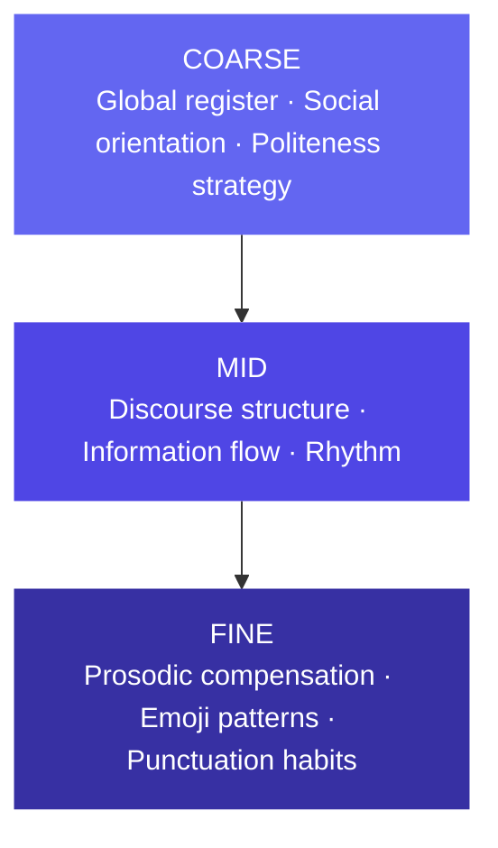
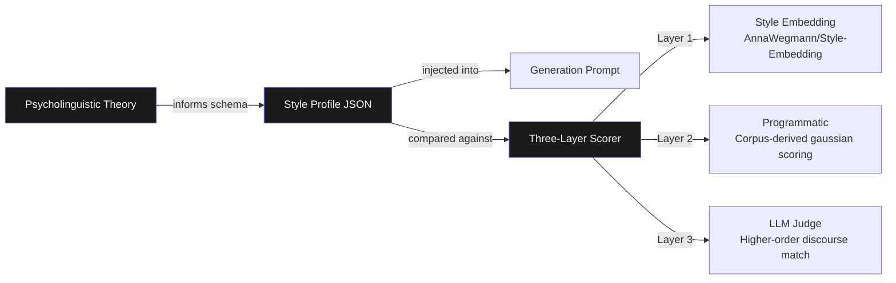

# Tone & Style Simulator

> Extract someone's psycholinguistic fingerprint from their real writing. Generate new text that authentically matches their voice.

---

## What This Is

Most style transfer tools treat writing style as a bag of surface features: emoji count, sentence length, exclamation marks. This tool treats it as a psycholinguistic fingerprint.

Given a corpus of someone's real writing across contexts (emails, Slack messages, texts), the app extracts a structured style profile grounded in computational psycholinguistics research, then generates new text that authentically matches their voice for any writing context. A three-layer scoring system evaluates how well the output matches the original style, combining neural style embeddings, corpus-derived statistical features, and an LLM judge.

The result is a system where the research directly shapes the engineering. The profile schema is the theoretical model, the scorer is the measurement apparatus, and neither works without the other.

---

## The Spike: Psycholinguistically Grounded Cognitive Style Hierarchy

Most candidates will build a feature extractor. This is a theoretical model instantiated as a working system.

### The Core Idea

Writing style has structure. It is not a flat list of features but a hierarchy of signals operating at different levels of abstraction - from broad social orientation down to individual punctuation habits. This architecture is borrowed directly from cognitive neuroscience.

Moshe Bar's predictive coding theory and gist-first perception model (Bar, 2004) proposes that the brain processes percepts coarse-to-fine: global structure first, local detail second. The same principle applies to writing style. A reader identifies someone's voice by first detecting their broad register and social orientation, then their discourse habits, then their surface-level quirks. The style profile mirrors this exactly.

### The Research Grounding

Every dimension in the style profile has a citation behind it:

**Pronoun ratio and social orientation** come from James Pennebaker's LIWC research, which demonstrates that function word usage (especially pronouns) is one of the most reliable and content-independent style signals available. High you-frequency reliably indicates other-focused communicators regardless of topic.

**Positive vs negative politeness** comes from Brown and Levinson's politeness theory (1987). Classifying a writer's politeness strategy as solidarity-based (positive) or face-saving (negative) is a genuine psycholinguistic dimension, not a vague "tone" label.

**Register variation and corpus design** follow Biber's multi-dimensional register analysis (1988). A corpus spanning multiple communication contexts (email, Slack, WhatsApp) is required to distinguish stable style signals from register-specific adaptations. Features consistent across registers are voice. Features that vary with register are context.

**Prosodic compensation** (letter elongation, punctuation stacking, emoji-as-tone-marker) draws on research into textual prosody - how writers compensate for the absence of speech prosody in written communication.

**Small corpus reliability** follows Pennebaker's finding that psycholinguistic feature extraction requires a minimum of approximately 1,000 words for reliable LIWC scores. Below that threshold, confidence intervals on feature estimates become too wide to be useful, which directly informs our dynamic weighting system.

### The Engineering Instantiation

The research shapes every engineering decision:

The AnnaWegmann/Style-Embedding model was chosen specifically because it was trained contrastively to separate style from content: texts from the same author writing about different topics should be more similar than texts from different authors on the same topic. This is Level 4 of the style/content separation problem addressed implicitly through model selection rather than additional engineering.

The profile schema is not a list of arbitrary features. It is a theoretical model of writing style derived from the literature, with each dimension chosen because it has been shown to be reliable, content-independent, and discriminative across authors.

---
