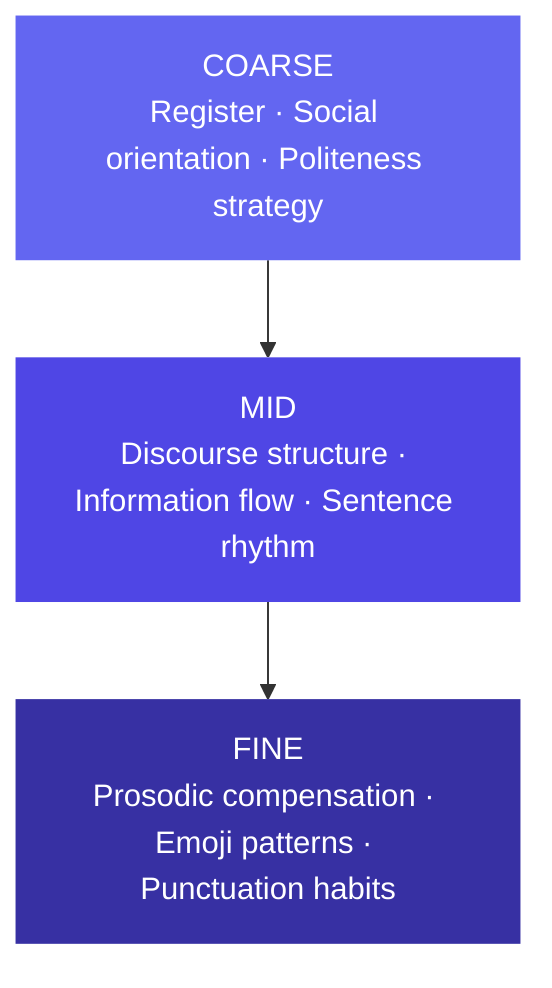
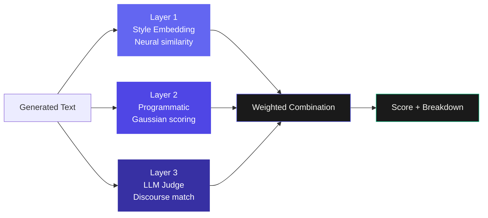

# Tone & Style Simulator

> Extract someone's psycholinguistic fingerprint from their real writing. Generate new text that authentically matches their voice.


**[Live Demo](https://rezapleasehirehim.com)** · **[Colab Notebook](./colab/scorer.ipynb)**

---

## Table of Contents

- [What This Is](#what-this-is)
- [The Spike](#the-spike)
- [Architecture](#architecture)
- [The Three-Layer Scorer](#the-three-layer-scorer)
- [How I Built It](#how-i-built-it)
- [Considerations](#considerations)
- [What's Next](#whats-next)
- [Corpus](#corpus)

---

## What This Is

Most style transfer tools treat writing style as a bag of surface features: emoji count, sentence length, exclamation marks. This tool treats it as a psycholinguistic fingerprint.

Given a corpus of someone's real writing across contexts (emails, Slack messages, texts), the app extracts a structured style profile grounded in computational psycholinguistics research, then generates new text that authentically matches their voice for any writing context. A three-layer scoring system evaluates how well the output matches the original style, combining neural style embeddings, corpus-derived statistical features, and an LLM judge.

The research directly shapes the engineering. The profile schema is the theoretical model. The scorer is the measurement apparatus. Neither works without the other.

---

## The Spike

### A Psycholinguistically Grounded Cognitive Style Hierarchy

Writing style has structure. It is not a flat list of features but a hierarchy of signals operating at different levels of abstraction, from broad social orientation down to individual punctuation habits.

[Moshe Bar's predictive coding and gist-first perception theory](https://www.nature.com/articles/nrn1476) proposes that the brain processes percepts coarse-to-fine: global structure first, local detail second. The same principle applies to writing style. A reader identifies someone's voice by first detecting their broad register and social orientation, then their discourse habits, then their surface-level quirks. The style profile mirrors this exactly.



### Research Grounding

Every dimension in the style profile has a citation behind it.

**Pronoun ratio and social orientation** — [Pennebaker & King (1999)](https://psycnet.apa.org/doi/10.1037/0022-3514.77.6.1296) and the [LIWC framework](https://www.cs.cmu.edu/~ylataus/files/TausczikPennebaker2010.pdf) demonstrate that function word usage, especially pronouns, is one of the most reliable and content-independent style signals available. High you-frequency reliably indicates other-focused communicators regardless of topic.

**Positive vs negative politeness** — [Brown and Levinson's politeness theory](https://en.wikipedia.org/wiki/Politeness_theory) establishes solidarity-based (positive) and face-saving (negative) politeness as genuine psycholinguistic dimensions, not vague tone labels.

**Register variation and corpus design** — [Biber's multi-dimensional register analysis](https://en.wikipedia.org/wiki/Register_(sociolinguistics)) establishes that a corpus spanning multiple communication contexts is required to distinguish stable style signals from register-specific adaptations. Features consistent across registers are voice. Features that vary with register are context.

**Prosodic compensation** — letter elongation, punctuation stacking, and emoji-as-tone-marker draw on research into textual prosody: how writers compensate for the absence of speech prosody in written communication.

**Small corpus thresholds** — Pennebaker's LIWC research establishes approximately 1,000 words as the minimum for reliable psycholinguistic feature extraction, which directly informs the dynamic weighting system.

### The Engineering Instantiation

```
Psycholinguistic Theory
        ↓ informs schema
Style Profile JSON (34 dimensions, 3 levels)
        ↓                         ↓
Generation Prompt          Three-Layer Scorer
                                   ↓
        ┌──────────────────────────┼──────────────────────────┐
   Layer 1                    Layer 2                    Layer 3
Style Embedding             Programmatic                LLM Judge
AnnaWegmann model           Gaussian scoring            Claude
Content-agnostic            Corpus-derived              Discourse-level
neural similarity           statistics                  pattern match
```

[AnnaWegmann/Style-Embedding](https://huggingface.co/AnnaWegmann/Style-Embedding) ([paper](https://arxiv.org/abs/2302.09327)) was chosen specifically because it was trained contrastively to separate style from content: same-author texts on different topics should be more similar than different-author texts on the same topic. Style/content separation addressed at the model selection level, not through additional engineering.

---

## Architecture

<details>
<summary><strong>System Flow</strong></summary>

```
Corpus (emails, Slack, texts)
        ↓
[ingest-corpus]
Parses, counts messages, stores in Supabase
        ↓
[extract-style]
Claude extracts 34-dimension style profile
Corpus samples stored, raw text deleted for privacy
        ↓
Style Profile stored in Supabase
        ↓                         ↓
[generate]                   [score]
Claude generates              Three-layer scorer runs
text in voice                 updates generation row
        ↓                         ↓
Generation + Score stored in Supabase
```

</details>

### Edge Functions

| Function | Input | What it does |
|---|---|---|
| `ingest-corpus` | raw text, metadata | Parses, counts messages, stores corpus |
| `extract-style` | corpus_id | Extracts 34-dimension profile, deletes raw text |
| `generate` | style_profile_id, prompt, context_type | Generates text in target voice |
| `score` | generation_id | Runs three-layer scorer, updates row |
| `delete-corpus` | corpus_id | Cascades deletion through all derived data |
| `delete-generation` | generation_id | Removes individual generation |

### Generation Pipeline

The generator is a swappable module with a fixed interface:

```
generate(style_profile_id, prompt, context_type) → output
```

| Version | Approach | Status |
|---|---|---|
| V1 | Single Claude call with full style profile in system prompt | Shipped |
| V2 | Two-stage: content draft then style transfer via few-shot | Designed |
| V3 | Two-stage: content draft then fine-tuned mini model | Future |

In-context style transfer outperforms fine-tuning at low data regimes (under ~500 messages), which is why V1 ships first. The interface is fixed across all versions so swapping requires no changes to the rest of the system.

### Tech Stack

| Layer | Technology |
|---|---|
| Frontend | React via Lovable, deployed to custom domain |
| Backend | Supabase Edge Functions (Deno/TypeScript) |
| Database | Supabase Postgres |
| Extraction + Generation | Anthropic API (claude-sonnet-4-6) |
| Style Embedding | AnnaWegmann/Style-Embedding via HuggingFace Inference API |
| AI Tooling | Claude (architecture, prompts), Codex (backend), Lovable (frontend) |

---

## The Three-Layer Scorer



### Layer 1: Style Embedding

Uses [AnnaWegmann/Style-Embedding](https://huggingface.co/AnnaWegmann/Style-Embedding), a RoBERTa model trained for stylistic similarity rather than semantic similarity. Cosine similarity between the generated text and a stratified corpus sample is normalized against a within-corpus baseline.

Standard cosine normalization clips negative values to zero, discarding real information. The correct approach maps the full $[-1, 1]$ range first:

$$\hat{r} = \frac{r + 1}{2}, \quad \hat{b} = \frac{b + 1}{2}, \quad score = \frac{\hat{r}}{\hat{b}} \times 0.85$$

### Layer 2: Programmatic Scorer

Every threshold is computed from the actual corpus. No hardcoded values. The scorer adapts to any writer automatically.

For continuous features (exclamation density, question frequency, sentence length), scoring uses a Gaussian penalty:

$$score = \exp\left(-\frac{1}{2}\left(\frac{x - \mu}{\sigma}\right)^2\right)$$

High $\sigma$ means the writer is naturally variable on that feature, so the scorer is automatically more forgiving. For binary features (emoji presence, doubling patterns), a standard Gaussian fails because it penalizes deviation from the mean symmetrically. Binary features use a tendency-weighted score that rewards agreement with the corpus tendency, scaled by how strong that tendency is.

### Layer 3: LLM Judge

Evaluates higher-order dimensions that resist programmatic measurement: register match, information structure, social orientation, politeness strategy, and opener/closer pattern alignment. Receives only the global and mid-level profile sections to prevent double-counting surface features already covered by Layer 2.

### Dynamic Weighting

<details>
<summary><strong>Weighting logic</strong></summary>

The ensemble weights adapt to data availability:

$$w_{prog} = 0.35 \times \min\left(\frac{n}{50}, 1\right)$$

$$w_{llm} = 0.30 + (0.35 - w_{prog})$$

When style embedding is unavailable, its 0.35 weight redistributes to the LLM judge. This is an implicit Bayesian ensemble: with abundant data, the data-driven layers dominate. With sparse data, the linguistically-informed prior (LLM judge) dominates.

</details>

Both the programmatic scorer and style embedding use **register-matched comparisons**. A formal email generation is scored against corpus emails and normalized against the email-to-email baseline, not the global corpus baseline. This prevents the scorer from penalizing register-appropriate behavior as a style mismatch.

---

## How I Built It

### AI Tooling

**Claude** was the thinking partner for the entire architecture. The psycholinguistic framing, profile schema design, scoring methodology, and every prompt in the system were developed conversationally before a single line of code was written. Claude also runs inside the app for extraction, generation, and LLM judging. Claude was chosen over other models for its superior natural language generation and instruction-following precision, both of which matter enormously when output quality is the product.

**Codex** handled all backend implementation. The six Edge Functions, Supabase schema, RLS policies, and deployment were written and iterated by Codex connected to the repo via MCP. The Supabase MCP connection meant Codex could create tables, run migrations, and verify deployments directly without copy-pasting SQL.

**Lovable** built the entire frontend. The design brief specified a dark research-tool aesthetic inspired by Linear and Perplexity, with a terminal-style loading animation tied to real API timing, a collapsible profile display, and a three-layer score breakdown.

### Development Order

1. Designed the style profile schema before writing any code
2. Validated the full pipeline in Google Colab before productionizing
3. Built and tested each Edge Function individually with curl smoke tests
4. Built the frontend against mock data, then wired to real APIs
5. Iterated on the UI with real corpus data

Validating in Colab first was the right call. The scorer went through several iterations (Gaussian vs hard thresholds, global vs register-aware baselines, full-range cosine normalization) that would have been painful to debug inside a deployed Edge Function.

---

## Considerations

### What happens when the corpus is small?

<details>
<summary><strong>Full answer</strong></summary>

Small corpora affect extraction and scoring differently.

At **extraction**, the core problem is distinguishing "not observed" from "not present." A feature absent from a 10-message corpus may simply be unobserved, not genuinely absent. The extraction prompt explicitly instructs Claude to make this distinction and to flag dimensions with thin evidence in an `extraction_metadata` block. The UI surfaces these flags directly on the profile page.

At **scoring**, small $n$ produces wide confidence intervals on corpus statistics. Each feature's confidence interval is computed as:

$$CI = 1.96 \cdot \frac{\sigma}{\sqrt{n}}$$

Features whose intervals exceed 50% of the mean are automatically down-weighted. The ensemble weight on the programmatic scorer scales as $\min(n/50, 1)$, shifting toward the LLM judge as data decreases. This is a principled Bayesian fallback: with sparse data, the linguistically-informed prior dominates over the noisy likelihood.

The app enforces a minimum of 5 messages at upload and surfaces confidence levels (high, medium, low) throughout the profile and score display.

</details>

### How do you distinguish style from content?

<details>
<summary><strong>Full answer</strong></summary>

This is the hardest problem in stylometric analysis. Three layers of separation are in place.

The **extraction prompt** explicitly instructs Claude to ask: "Would this pattern appear regardless of what the person was writing about? If no, it is content. If yes, it is style."

The **generation prompt** instructs Claude to match how the person writes, not what they write about.

The **[AnnaWegmann/Style-Embedding](https://huggingface.co/AnnaWegmann/Style-Embedding)** model addresses this at the measurement layer. It was trained contrastively so that same-author texts on different topics are more similar than different-author texts on the same topic, making the style embedding inherently content-agnostic.

A more systematic treatment would add function word profiling (Pennebaker's most content-independent style signal), content neutralization before embedding (replacing named entities and domain nouns with generic tokens), and cross-register consistency validation to identify which features are stable across topics. These are the clearest next steps.

</details>

### How would this scale to 10,000+ messages?

<details>
<summary><strong>Full answer</strong></summary>

Three components need architectural changes at scale.

**Extraction** cannot send 10,000 messages to Claude in one prompt. The solution is chunked MapReduce extraction: divide the corpus into stratified chunks of roughly 150 messages per register, extract partial profiles from each, then merge by averaging numerical scores and taking the union of qualitative fields. Extraction becomes an async background job rather than a synchronous request.

**Style embedding** becomes expensive at scale. The solution is to store message embeddings in Supabase using pgvector, compute them incrementally as messages arrive, and use approximate nearest neighbor search at scoring time rather than re-encoding everything fresh.

**The profile** becomes incrementally updatable. New messages nudge the existing profile rather than triggering full re-extraction, and enable drift detection if a person's writing style changes over time.

Corpus statistics (mean, std per feature) are $O(n)$ arithmetic and scale without any architectural change.

</details>

### What are the privacy implications?

<details>
<summary><strong>Full answer</strong></summary>

Personal communications contain intimate data by definition. Four mitigations are implemented.

**Raw corpus text is deleted immediately after extraction.** Only the lossy style profile and a small stratified sample of messages (45 messages maximum, used for scoring) are retained. The profile cannot be used to reconstruct the original messages.

**Explicit consent** — a checkbox requires users to confirm the writing is their own before processing begins. A disclosure note informs users that text is sent to Anthropic's API for analysis.

**One-click deletion** cascades through all derived data including profiles, generations, and scores via database foreign key constraints.

The most privacy-preserving future direction is local model inference, where the style extractor runs on-device and raw communications never leave the user's machine.

</details>

---

## What's Next

| Direction | Description | Effort |
|---|---|---|
| V2 Generation Pipeline | Two-stage content + style transfer | Medium |
| Function Word Analysis | Pennebaker's most content-independent signal as a fourth scoring layer | Low |
| Systematic Style/Content Separation | Content neutralization, cross-register validation, topic modeling | High |
| Fine-Tuned Mini Model | Replace second-stage call with model trained on corpus at 500+ messages | High |
| Local Inference | On-device extraction, raw communications never leave the machine | Very High |

---

## Corpus

The included corpora are `corpus/reza_corpus.txt` and `corpus/hillary_emails_cleaned.txt`.

`corpus/reza_corpus.txt` contains 276 messages across three registers: WhatsApp personal conversations, Slack professional messages, and sent emails. The corpus spans casual social coordination, professional technical collaboration, and formal academic and job-seeking correspondence, providing enough register variation to validate the multi-register extraction and register-aware scoring system.

`corpus/hillary_emails_cleaned.txt` provides a second corpus focused on formal email communication, useful for evaluating the pipeline on a more single-register, institutionally formal writing style.

---

<p align="center">Built with Claude · Codex · Lovable · Supabase</p>
