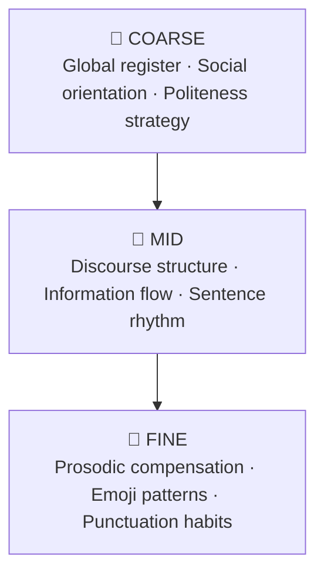

# Tone & Style Simulator

> Extract someone's psycholinguistic fingerprint from their real writing. Generate new text that authentically matches their voice.


---

## What This Is

Most style transfer tools treat writing style as a bag of surface features: emoji count, sentence length, exclamation marks. This tool treats it as a psycholinguistic fingerprint.

Given a corpus of someone's real writing across contexts (emails, Slack messages, texts), the app extracts a structured style profile grounded in computational psycholinguistics research, then generates new text that authentically matches their voice for any writing context. A three-layer scoring system evaluates how well the output matches the original style, combining neural style embeddings, corpus-derived statistical features, and an LLM judge.

The result is a system where the research directly shapes the engineering. The profile schema is the theoretical model, the scorer is the measurement apparatus, and neither works without the other.

---

## The Spike: Psycholinguistically Grounded Cognitive Style Hierarchy

Most candidates will build a feature extractor. This is a theoretical model instantiated as a working system.

### The Core Idea

Writing style has structure. It is not a flat list of features but a hierarchy of signals operating at different levels of abstraction - from broad social orientation down to individual punctuation habits. This architecture is borrowed directly from cognitive neuroscience.

Moshe Bar's predictive coding theory and gist-first perception model (Bar, 2004) proposes that the brain processes percepts coarse-to-fine: global structure first, local detail second. The same principle applies to writing style. A reader identifies someone's voice by first detecting their broad register and social orientation, then their discourse habits, then their surface-level quirks. The style profile mirrors this exactly.



### The Research Grounding

Every dimension in the style profile has a citation behind it:

**Pronoun ratio and social orientation** come from James Pennebaker's LIWC research, which demonstrates that function word usage (especially pronouns) is one of the most reliable and content-independent style signals available. High you-frequency reliably indicates other-focused communicators regardless of topic.

**Positive vs negative politeness** comes from Brown and Levinson's politeness theory (1987). Classifying a writer's politeness strategy as solidarity-based (positive) or face-saving (negative) is a genuine psycholinguistic dimension, not a vague "tone" label.

**Register variation and corpus design** follow Biber's multi-dimensional register analysis (1988). A corpus spanning multiple communication contexts (email, Slack, WhatsApp) is required to distinguish stable style signals from register-specific adaptations. Features consistent across registers are voice. Features that vary with register are context.

**Prosodic compensation** (letter elongation, punctuation stacking, emoji-as-tone-marker) draws on research into textual prosody - how writers compensate for the absence of speech prosody in written communication.

**Small corpus reliability** follows Pennebaker's finding that psycholinguistic feature extraction requires a minimum of approximately 1,000 words for reliable LIWC scores. Below that threshold, confidence intervals on feature estimates become too wide to be useful, which directly informs our dynamic weighting system.

### The Engineering Instantiation

The research shapes every engineering decision:

```text
Psycholinguistic Theory
        ↓ informs schema
Style Profile JSON (34 dimensions across 3 levels)
        ↓                    ↓
Generation Prompt      Three-Layer Scorer
                            ↓
              ┌─────────────┼─────────────┐
         Layer 1         Layer 2       Layer 3
      Style Embedding  Programmatic   LLM Judge
      (AnnaWegmann)    (Gaussian)     (Claude)
      Content-agnostic  Corpus-derived  Discourse-level
      neural similarity  statistics     pattern match
```

The AnnaWegmann/Style-Embedding model was chosen specifically because it was trained contrastively to separate style from content: texts from the same author writing about different topics should be more similar than texts from different authors on the same topic. This is Level 4 of the style/content separation problem addressed implicitly through model selection rather than additional engineering.

The profile schema is not a list of arbitrary features. It is a theoretical model of writing style derived from the literature, with each dimension chosen because it has been shown to be reliable, content-independent, and discriminative across authors.

---

## Architecture
### System Overview
```
Corpus (emails, Slack, texts)
    ↓
[ingest-corpus] — parses, counts messages, stores in Supabase
    ↓
[extract-style] — Claude extracts 34-dimension style profile
Corpus samples stored, raw text deleted for privacy
    ↓
Style Profile stored in Supabase
    ↓                    ↓
[generate]              [score]
Claude generates        Three-layer scorer runs
text in voice           updates generation row
    ↓                    ↓
Generation + Score stored in Supabase
```
### The Four Edge Functions

ingest-corpus — accepts raw text and metadata, parses and stores the corpus
extract-style — calls Claude with the corpus, extracts the 34-dimension profile, stores corpus samples, deletes raw text
generate — calls Claude with the style profile and prompt, stores the output
score — runs the three-layer scorer against the generation, updates the row

### The Generation Pipeline
The generator is a swappable module with a fixed interface. V1 is a single Claude call with the full style profile injected into the system prompt. V2 is a two-stage pipeline separating content generation from style transfer — a content-faithful draft first, then a second call that translates it into the target voice using the profile and corpus examples as few-shot demonstrations. V1 outperforms fine-tuning at low data regimes under 500 messages, which is the realistic scenario for most users. V2 becomes strictly better at scale. V3 replaces the second call with a fine-tuned mini model trained on the corpus.

### Tech Stack

Frontend: React via Lovable, deployed to custom domain
Backend: Supabase Edge Functions (Deno/TypeScript)
Database: Supabase Postgres
Style Extraction and Generation: Anthropic API (claude-sonnet-4-6)
Style Embedding: AnnaWegmann/Style-Embedding via HuggingFace Inference API
AI Tooling: Claude (thinking partner and extraction), Codex (backend), Lovable (frontend)

## The Three-Layer Scorer
Scoring style match is harder than scoring style generation. Most approaches either use pure LLM judgment (black box, no interpretability) or pure surface feature counting (no understanding of higher-order patterns). This scorer uses three layers that complement each other's blind spots.
```
Generated Text
    ↓                    ↓                    ↓
Layer 1              Layer 2              Layer 3
Style Embedding      Programmatic         LLM Judge
Neural similarity    Corpus-derived       Higher-order
against corpus       gaussian scoring     discourse match
    ↓                    ↓                    ↓
Weighted combination (register-aware, data-adaptive)
    ↓
Overall Score + Breakdown
```
### Layer 1: Style Embedding
Uses AnnaWegmann/Style-Embedding, a RoBERTa model trained specifically for stylistic similarity rather than semantic similarity. Standard sentence embeddings measure whether two texts mean the same thing. This model measures whether two texts sound like the same person, independent of topic.
The generated text is encoded alongside a stratified sample of corpus messages. Cosine similarity is computed and normalized against a within-corpus baseline — the average similarity between corpus messages themselves. A score of 1.0 means the generation matches the corpus as well as corpus messages match each other.
One important correction to standard cosine similarity normalization: cosine similarity lives in [-1, 1] not [0, 1]. Clipping negative values to zero throws away real information. The correct normalization maps the full range before computing relative scores:
```
normalizedRaw = (raw + 1) / 2
normalizedBaseline = (baseline + 1) / 2
score = normalizedRaw / normalizedBaseline * 0.85
```
### Layer 2: Programmatic Scorer
Measures surface-level stylistic features against corpus-derived statistics. Every threshold is computed from the actual corpus — no hardcoded values. This means the scorer adapts to any writer automatically.
For continuous features (exclamation density, question frequency, sentence length, period usage), scoring uses a Gaussian penalty centered on the corpus mean:
```
score = exp(-0.5 * ((generated_value - corpus_mean) / corpus_std)^2)
```
A high corpus standard deviation means the writer is variable on that feature, so the scorer is automatically more forgiving. A low standard deviation means they are consistent, so deviation actually matters.
For binary features (emoji presence, doubling patterns), a standard Gaussian fails because it penalizes any deviation from the corpus mean. A binary feature with 40% occurrence rate would penalize both presence and absence equally near the threshold. Instead, binary features use a tendency-weighted score that rewards agreement with the corpus tendency, scaled by how strong that tendency is.
### Layer 3: LLM Judge
Evaluates higher-order style dimensions that resist programmatic measurement: register match, information structure, social orientation, politeness strategy, and opener/closer pattern alignment. These are the dimensions the programmatic scorer cannot reach.
The LLM judge receives only the global and mid-level sections of the style profile — not the local section — to prevent it from double-counting surface features already covered by Layer 2.
### Dynamic Weighting
The three layers are combined with weights that adapt to data availability:

When corpus has fewer than 50 messages, the programmatic scorer is down-weighted proportionally because corpus statistics have wide confidence intervals at small n. Formally: weight scales as min(n/50, 1), which is a reliability weighting derived from the Law of Large Numbers.
When style embedding returns a negative raw similarity (common in formal email contexts where the corpus is predominantly casual), it is handled via full-range normalization rather than zero-clipping.
When style embedding is unavailable (HuggingFace cold start or timeout), its weight redistributes to the LLM judge automatically.

This is an implicit Bayesian ensemble. With abundant data, the data-driven layers dominate. With sparse data, the linguistically-informed prior (LLM judge) dominates. The ensemble degrades gracefully rather than failing.
### Register-Aware Scoring
Both the programmatic scorer and style embedding use register-matched comparisons. A formal email generation is scored against corpus emails and normalized against the email-to-email baseline, not the global corpus baseline. This prevents the scorer from penalizing register-appropriate behavior as a style mismatch.

## How I Built It
### AI Tooling
This project was built with AI throughout, not just as an afterthought.
Claude was the thinking partner for the entire architecture. The psycholinguistic framing, the profile schema design, the scoring methodology, and every prompt in the system were developed conversationally before a single line of code was written. Claude also runs inside the app itself for extraction, generation, and LLM judging. Claude was chosen over other models for its superior natural language generation and instruction-following precision, both of which matter enormously when the output quality is the product.
Codex handled all backend implementation. The six Edge Functions, Supabase schema, RLS policies, and deployment were written and iterated by Codex connected to the repo via MCP. The Supabase MCP connection meant Codex could create tables, run migrations, and verify deployments directly without copy-pasting SQL.
Lovable built the entire frontend. The design brief specified a dark research-tool aesthetic inspired by Linear and Perplexity, with a terminal-style loading animation tied to real API timing, a collapsible profile display, and a three-layer score breakdown.
### Development Order

Designed the style profile schema before writing any code
Validated the full pipeline in Google Colab before productionizing
Built and tested each Edge Function individually with curl smoke tests
Built the frontend against mock data, then wired to real APIs
Iterated on the UI with real corpus data

Validating in Colab first was the right call. The scorer went through several iterations that would have been painful to debug inside a deployed Edge Function.

## Considerations
### What happens when the corpus is small?
Small corpora affect both extraction and scoring differently.
At extraction, the problem is the sparse data problem: features that do not appear in a short corpus may simply be unobserved rather than absent. The extraction prompt explicitly instructs Claude to distinguish between "not observed" and "not present," and to flag dimensions with thin evidence in an extraction_metadata block. The UI surfaces these flags directly on the profile page so the user knows which dimensions to trust.
At scoring, small n produces wide confidence intervals on corpus statistics. The programmatic scorer handles this through reliability-weighted scoring: each feature's confidence interval is computed as 1.96 * std / sqrt(n), and features whose intervals exceed 50% of the mean are down-weighted automatically. The ensemble weight on the programmatic scorer scales as min(n/50, 1), shifting toward the LLM judge as data decreases. This is a principled Bayesian fallback: with sparse data, the linguistically-informed prior dominates over the noisy likelihood. Pennebaker's LIWC research establishes approximately 1,000 words as the minimum for reliable psycholinguistic feature extraction, which directly informed these thresholds.
The app enforces a minimum of 5 messages at upload and surfaces confidence levels (high, medium, low) throughout the profile and score display.
### How do you distinguish style from content?
This is the hardest problem in stylometric analysis. Three layers of separation are in place.
The extraction prompt explicitly instructs Claude to ask: "Would this pattern appear regardless of what the person was writing about? If no, it is content. If yes, it is style." Technical vocabulary is flagged as a style signal only when it reflects complexity and register preference, not domain knowledge.
The generation prompt instructs Claude to match how the person writes, not what they write about.
The AnnaWegmann/Style-Embedding model addresses this at the measurement layer. It was trained contrastively so that same-author texts on different topics are more similar than different-author texts on the same topic, making the style embedding inherently content-agnostic.
A more systematic treatment would add function word profiling (Pennebaker's most content-independent style signal), content neutralization before embedding, and cross-register consistency validation to identify which features are stable across topics. These are clear next steps.
### How would this scale to 10,000 messages?
Three components need architectural changes at scale.
Extraction cannot send 10,000 messages to Claude in one prompt. The solution is chunked MapReduce extraction: divide the corpus into stratified chunks of roughly 150 messages per register, extract partial profiles from each, then merge by averaging numerical scores and taking the union of qualitative fields. Extraction becomes an async background job rather than a synchronous request.
Style embedding becomes expensive at scale. The solution is to store message embeddings in Supabase using pgvector, compute them incrementally as messages arrive, and use approximate nearest neighbor search at scoring time rather than re-encoding everything fresh.
The profile becomes incrementally updatable. New messages nudge the existing profile rather than triggering full re-extraction. This also enables drift detection: if a person's writing style changes over time, the profile can reflect it.
Corpus statistics (mean, std per feature) are O(n) arithmetic and scale without any architectural change.
### What are the privacy implications?
Personal communications contain intimate data by definition. Four mitigations are implemented.
Raw corpus text is deleted immediately after style extraction. Only the lossy style profile and a small stratified sample of messages (45 messages maximum, used for scoring) are retained. The profile cannot be used to reconstruct the original messages.
An explicit consent checkbox requires users to confirm the writing is their own before processing begins. A disclosure note informs users that text is sent to Anthropic's API for analysis.
One-click corpus deletion cascades through all derived data including profiles, generations, and scores via database foreign key constraints.
The most privacy-preserving future direction is local model inference, where the style extractor runs on-device and raw communications never leave the user's machine.

## What's Next
The current implementation is a complete, working system. These are the most meaningful directions forward.
### V2 Generation Pipeline
The generator is architected to be swappable. V2 separates content generation from style transfer into two sequential calls. Stage 1 generates a content-faithful draft. Stage 2 translates it into the target voice using the style profile and corpus examples as few-shot demonstrations. This is strictly better than V1 at scale but in-context style transfer outperforms fine-tuning at low data regimes, which is why V1 ships first.
### Function Word Analysis
Pennebaker's research identifies function words (articles, prepositions, conjunctions, pronouns) as the most reliable and content-independent style signals. Adding a dedicated function word frequency profile as a fourth scoring layer would make the style/content separation more systematic and the scorer more robust to topic shift.
### Style vs Content: Systematic Separation
The current approach handles style/content separation through prompt engineering and model selection. A more rigorous treatment would add content neutralization before embedding (replacing named entities and domain nouns with generic tokens before computing style similarity), cross-register consistency validation (features stable across all three registers are voice, features that vary are context), and topic modeling to measure style on the residual variance unexplained by topic. The theoretical framework for this exists in the literature. The engineering path is clear.
### Fine-Tuned Mini Model
At sufficient corpus size (roughly 500 messages and above), a small model fine-tuned directly on the corpus would outperform in-context style transfer for the generation stage. The architecture already anticipates this: the generate Edge Function interface is fixed, and swapping the second stage call to a fine-tuned endpoint requires no changes to the rest of the system.
### Local Inference
Running both extraction and generation on-device would eliminate the privacy tradeoff entirely. Raw communications would never leave the user's machine. This is technically feasible with current small model capabilities and is the most meaningful long-term direction for a tool that ingests personal data.

## Corpus
The demo corpus used in development is included at corpus/reza_corpus.txt. It contains 276 messages across three registers: WhatsApp personal conversations, Slack professional messages, and sent emails. The corpus spans casual social coordination, professional technical collaboration, and formal academic and job-seeking correspondence, providing enough register variation to validate the multi-register extraction and register-aware scoring system.
